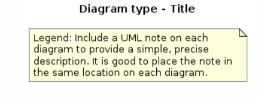

# UML2-Playground
A repository for experimenting with UML2 diagrams using PlantUML. This space is dedicated to creating, sharing, and exploring various UML diagrams, including class diagrams, sequence diagrams, and more.

